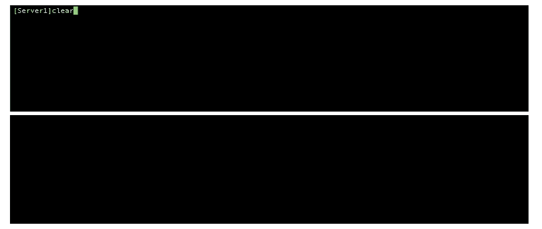
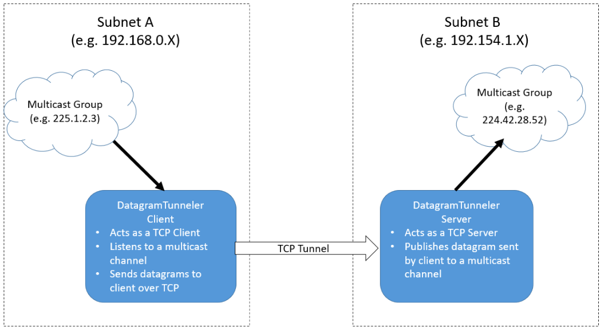
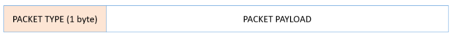
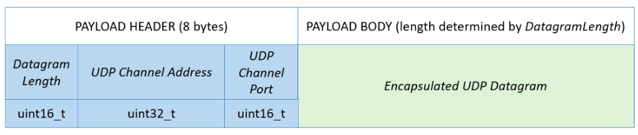

# DatagramTunneler

[](https://www.gnu.org/licenses/gpl-3.0.en.html)

<!--

-->



Simple cross-platform client/server program forwarding UDP datagrams through a TCP connection (aka tunnel). The client joins a multicast group and forwards the received datagrams to the server, which in turns multicasts them on its own subnet.

* Designed with simplicity in mind
* Tested on *OSX 10.13.3*, *Ubuntu 16.04* and *Centos 7.4* (obviously not Windows compatible)

## Synopsis
In order to use the DatagramTunneler you need to start the server side first, then the client side. If you don't, the client will just fail to connect to the server and exit right away.
### Server
```
  dgramtunneler --server -i <udp_iface_ip> -t <tcp_listen_port> [-u <udp_dst_ip>:<port>]
```
* **<udp_iface_ip>**: interface used to publish the forwarded datagrams
* **<tcp_listen_port>**: tcp port used to listen for client connections
* **<udp_dst_ip>:\<port>**: (optional) udp destination IP and port where the server is publishing the forwarded datagrams. If not provided, datagrams are published on the same channel joined by the client.
  
### Client
```
  dgramtunneler --client -i <udp_iface_ip> -t <tcp_srv_ip>:<tcp_srv_port> -u <udp_dst_ip>:<port>
```
* **<udp_iface_ip>**: interface used to join the multicast channel provided by -u
* **<tcp_srv_ip>:\<port>**: IP and port of the server to which the datagram will be forwarded
* **<udp_dst_ip>**:**\<port>**: udp destination IP and port of the channel we want to join
  
### Example
server side:
```
./bin/datagramtunneler --server -i 192.168.0.104 -u 228.14.28.52:1234 -t 28052
```

client side:
```
./bin/datagramtunneler --client -i 192.168.0.105 -u 228.1.2.3:7437 -t 192.168.0.104:28052
```

## How does it work?
The purpose of the DatagramTunneler is to transfer multicast data from one subnet A to another subnet B where that multicast channel is not available. To achieve this, the DatagramTunneler is split into 2 sides: a client side and a server side, as shown on the diagram below:


### The Client Side
The client side should run in the subnet where the multicast channel is joinable. Once started it will do the following:
* connect to the DatagramListener Server (TCP)
* join the multicast channel (UDP)
* forward all the received datagrams to the server using the established TCP connection. Datagrams are transmitted throught TCP using the [Datagram Tunneler Encapsulation Protocol (or DTEP)](#dtep).

### The Server Side
The server side should run in the subnet where the multicast is not available. Once started it will do the following:
* listen for a client connection (note that only one connection is accepted throughout the lifetime of the Server/Client instances. Once the tunnel is disconnected, both ends exit.
* once a connection with a client is established, it will publish all the datagrams sent by the client to a multicast channel. That channel can be anything specified when launching the server, or if not specified, it will used the same multicast channel encoded with the datagram it received (c.f. [DTEP](#dtep)).


<a name="dtep"/>

### The Datagram Tunneler Encapsulation Protocol (DTEP)
The Datagram Tunneler Protocol or DTEP is a simple binary protocol, which is described by the following diagram:


A DTEP packet has a 1 byte header specifying the type of payload it contains.
#### Packet Type 0x00 = HEARTBEAT
This type of packet has no payload. It is sent by the client to the server and helps ensure both ends of the connection know if the other end is alive.
#### Packet Type 0x01 = DATAGRAM
This packet encapsulates the datagram observed by the client. Here is its complete description:


Although this diagram should be self explanatory, here is a break down of all the fields:
* **Datagram Length**: number of bytes of the encapsulated datagram (the DTEP header length is NOT included)
* **UDP Channel Address**: destination address of the multicast group which the client joined to receive that datagram
* **UDP Channel Port**: destination port of the multicast group which the client joined to receive that datagram
* **Encapsulated UDP Datagram**: actual datagram received by the client from the multicast channel
