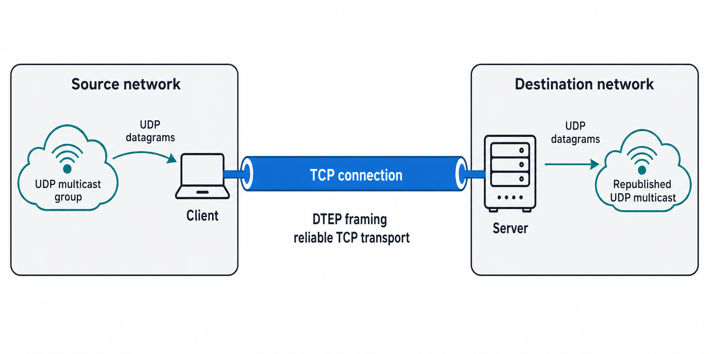

# DatagramTunneler

[](https://www.gnu.org/licenses/gpl-3.0.en.html)
[](https://github.com/MarkoPaul0/DatagramTunneler/releases/latest)


DatagramTunneler tunnels UDP multicast datagrams over a TCP connection. A client joins a multicast group, forwards received datagrams to a server, and the server republishes them on its own subnet.

It supports current Linux, macOS, and Windows 10/11 releases, direct command-line use, and reusable named tunnel definitions.

## What it is for

Use DatagramTunneler when a multicast-dependent application needs to cross a
routed, site-to-site, or test-network boundary. Typical uses include:

- relaying industrial, IoT, or monitoring telemetry to another network;
- feeding simulation, robotics, or hardware-in-the-loop test environments;
- testing multicast applications from a remote development or CI environment;
- sending one-way LAN-discovery announcements to a second subnet; and
- relaying a multicast feed to remote diagnostic, capture, or observability
  tooling.

### DatagramTunneler and generic tunnels

DatagramTunneler solves a different problem from generic public-endpoint tools
such as ngrok. It relays UDP multicast that the client can already receive; it
does not expose a local service to the public Internet, perform NAT traversal,
or provide a low-latency UDP transport. TCP's ordering and retransmission
behaviour can make it unsuitable for latency-sensitive real-time game traffic.

It is a better fit for multicast-dependent workflows such as LAN discovery,
telemetry, and cross-subnet testing.

The current tunnel is one-way from client to server and carries one client
connection per process. Discovery protocols that require replies need a
separate return path. The TCP connection is not encrypted or authenticated, so
run it on a trusted network or inside a secure overlay such as WireGuard or SSH.

See the [practical tutorials](docs/use-cases.md) for multicast relaying,
telemetry, and remote discovery-testing examples.

## Install

### Debian and Ubuntu

Check your Debian architecture:

```sh
dpkg --print-architecture
```

The latest published release is **v2.0.0**. It currently provides a Debian
package for AMD64 (`amd64`/`x86_64`):

```sh
curl -fLO https://github.com/MarkoPaul0/DatagramTunneler/releases/download/v2.0.0/dgramtunneler_2.0.0_amd64.deb
sudo apt install ./dgramtunneler_2.0.0_amd64.deb
dgramtunneler --version
```

| Debian architecture | CPU name | Package |
| --- | --- | --- |
| `amd64` | Intel/AMD 64-bit (`x86_64`) | Available |
| `arm64`, `armhf`, `i386` | ARM or 32-bit Intel/AMD | Not currently published |

For an architecture without a `.deb`, use the [source build](#build-from-source).
Do not install the `amd64` package on a different architecture. The
[latest release](https://github.com/MarkoPaul0/DatagramTunneler/releases/latest)
also contains portable Linux archives for the architectures listed there.

### macOS and Linux: Homebrew

Install from the official tap:

```sh
brew tap MarkoPaul0/dgramtunneler
brew install dgramtunneler
```

### Windows 10 and 11

The latest release currently provides a Windows AMD64 ZIP. Download and verify
it from PowerShell:

```powershell
$version = "2.0.0"
Invoke-WebRequest `
  -Uri "https://github.com/MarkoPaul0/DatagramTunneler/releases/download/v$version/dgramtunneler-$version-Windows-AMD64.zip" `
  -OutFile "dgramtunneler-$version-Windows-AMD64.zip"
Expand-Archive "dgramtunneler-$version-Windows-AMD64.zip" -DestinationPath dgramtunneler
& ".\dgramtunneler\dgramtunneler-$version-Windows-AMD64\bin\dgramtunneler.exe" --version
```

Add that `bin` directory to `PATH` for normal use. Windows ARM64, Winget,
Chocolatey, and Scoop packages are not published yet.

### Build from source

Requirements: a C++20-capable compiler and CMake 3.16 or newer.

```sh
cmake -S . -B build-cmake
cmake --build build-cmake
cmake --install build-cmake --prefix ~/.local
```

The legacy Makefile remains available with `make`, but CMake is the supported build and installation path.

## First tunnel

Create and edit the configuration at the platform-default path:

```sh
dgramtunneler config init
dgramtunneler config edit
dgramtunneler tunnel list
```

Run the server first, then the client:

```sh
dgramtunneler tunnel run office-server
dgramtunneler tunnel run office-client
```

In a third terminal, generate five test datagrams for the client tunnel:

```sh
dgramtunneler producer office-client --count 5
```

Use `dgramtunneler tunnel show <alias>` to inspect the definition and `dgramtunneler tunnel validate [alias]` to check it before running.

`producer <client-alias>` sends `Dummy datagram #1`, `Dummy datagram #2`, and
so on to that client tunnel's configured multicast group. It defaults to one
datagram per second until interrupted. Use `--count`, `--interval-ms`, and
`--payload-prefix` to control a test run.

## Named tunnels

Named definitions are stored in a versioned TOML configuration file. The default path is:

| Platform | Configuration path |
| --- | --- |
| macOS | `~/Library/Application Support/DatagramTunneler/config.toml` |
| Linux | `$XDG_CONFIG_HOME/dgramtunneler/config.toml`, or `~/.config/dgramtunneler/config.toml` |
| Windows | `%APPDATA%\DatagramTunneler\config.toml` |

Use `--config <path>` with any configuration or tunnel command to select another file.

```toml
version = 1

[tunnels.office-client]
mode = "client"
udp_interface = "192.168.1.20"
udp_group = "239.1.2.3:5000"
tcp_server = "192.168.1.10:14052"

[tunnels.office-server]
mode = "server"
udp_interface = "192.168.1.10"
tcp_listen_port = 14052
udp_destination = "replicate_client"
```

`config edit` creates the starter file if needed, then opens it using `$VISUAL`, `$EDITOR`, or TextEdit, `vi`, or Notepad. The parser rejects unknown fields, duplicate aliases, invalid IPv4 addresses, and invalid ports. `tunnel run` runs in the foreground.

### Compact live output

For a running tunnel, add `--compact` to keep one live statistics line and the
five most recent events in the terminal:

```sh
dgramtunneler tunnel run office-client --compact
```

The built-in producer supports the same display:

```sh
dgramtunneler producer office-client --compact
```

The statistics show forwarded datagram count, average datagram size, and
average throughput since the tunnel started. On a v2 server, they also show a
rolling latency average, p50, p99, and maximum for the most recent 1,024
datagrams. Compact mode activates only on an interactive terminal; when output
is redirected, normal line-oriented logs are kept so they remain easy to
capture and process. Its statistics line identifies the active client, server,
or producer route; event lines use short actions such as `forwarded`,
`published`, and `sent` rather than repeating the route for every datagram.

### Latency telemetry

Each DTEP v2 datagram carries the client wall-clock timestamp in microseconds.
The server prints its per-datagram tunnel latency and, every five seconds,
reports interval average, p50, p99, and maximum latency. These figures require
the client and server clocks to be reasonably synchronized (for example, with
NTP); a client clock ahead of the server is reported as unavailable rather than
as a misleading negative latency.

For server tunnels, `udp_destination = "replicate_client"` republishes to the
same multicast group and port joined by the client. Omitting `udp_destination`
retains the same legacy behaviour. Set it to an explicit `IPv4:port` endpoint
when the destination network should use a different group. Client-group
replication is for different source and destination subnets: using it on the
same subnet can create a multicast feedback loop. The server disables its own
local multicast loopback in replication mode, but it cannot prevent a separate
client host on the same subnet from receiving and re-forwarding the packet.

## Direct command-line use

Start the server before the client.

```sh
dgramtunneler --server -i <udp_iface_ip> -t <tcp_listen_port> [-u <udp_dst_ip>:<port>]
dgramtunneler --client -i <udp_iface_ip> -t <tcp_srv_ip>:<tcp_srv_port> -u <udp_dst_ip>:<port>
```

The server's `-u` destination is optional: when absent, it republishes each datagram to the multicast group encoded by the client.

## Create release packages

The root `VERSION` file is the release version. To create installable artifacts for the current platform:

```sh
cmake -S . -B build-cmake -DCMAKE_BUILD_TYPE=Release
cmake --build build-cmake
cpack --config build-cmake/CPackConfig.cmake -B release-artifacts
```

This produces `.tar.gz` and `.zip` archives named `dgramtunneler-<version>-<system>-<architecture>`. Linux also produces a Debian `.deb` package.

For Homebrew updates, use the [tap release procedure](packaging/homebrew/README.md).

## Publish a release

Pushing a semantic-version tag automatically validates the matching `VERSION` file, builds and tests release packages on macOS, Ubuntu, and Windows, creates the GitHub Release, uploads the artifacts, and attaches a `SHA256SUMS` file.

When the Homebrew tap automation is configured, publishing the release also opens a reviewed formula-update pull request in the tap. See the [tap release procedure](packaging/homebrew/README.md) for the one-time credential setup.

After merging the version bump to `master`:

```sh
git tag -a v<version> -m "DatagramTunneler <version>"
git push origin v<version>
```

The tag must exactly match `VERSION`: for example, `VERSION` `1.1.0` requires tag `v1.1.0`.

## Tests

The test suite covers protocol framing, command and configuration parsing, named-tunnel commands, and a loopback multicast round-trip test when Python 3 is available.

```sh
cmake -S . -B build-cmake -DBUILD_TESTING=ON
cmake --build build-cmake
ctest --test-dir build-cmake --output-on-failure
```

## How it works

DatagramTunneler transfers multicast traffic from a subnet where a multicast group is available to one where it is not. It has a client and a server:



### Client

Run the client where the multicast group is joinable. It connects to the server over TCP, joins the UDP multicast group, and forwards each received datagram using [DTEP](#dtep).

### Server

Run the server on the destination subnet. It accepts one client connection, then republishes each forwarded datagram to the configured UDP destination—or, when none is configured, to the group encoded in the DTEP packet. When either endpoint disconnects, both sides exit.

## DTEP

DTEP (Datagram Tunneler Encapsulation Protocol) is the binary framing used over
the TCP connection. The current protocol is **version 2**. Every frame starts
with a one-byte packet type and a one-byte protocol version; a peer using a
different version is rejected immediately with a clear error.

### `0x00` — Heartbeat

The client sends a two-byte type/version heartbeat to confirm that the
connection remains alive.

### `0x01` — Datagram

This packet encapsulates a UDP datagram observed by the client. Its fixed
18-byte header contains the following fields before the original payload:

| Field | Size | Purpose |
| --- | --- | --- |
| Type | 1 byte | `0x01` (datagram) |
| Protocol version | 1 byte | `0x02` |
| UDP group address | 4 bytes | IPv4 multicast group joined by the client |
| UDP group port | 2 bytes | Multicast port |
| Datagram length | 2 bytes | Original payload length |
| Client timestamp | 8 bytes | Unix epoch timestamp in microseconds |

* **Datagram length:** payload length, excluding the DTEP header.
* **UDP channel address and port:** the multicast group where the client received the datagram.
* **Client timestamp:** used by the server to calculate tunnel latency when
  both system clocks are synchronized.
* **Encapsulated UDP datagram:** the original UDP payload.

## Licensing

See [LICENSE](LICENSE).
