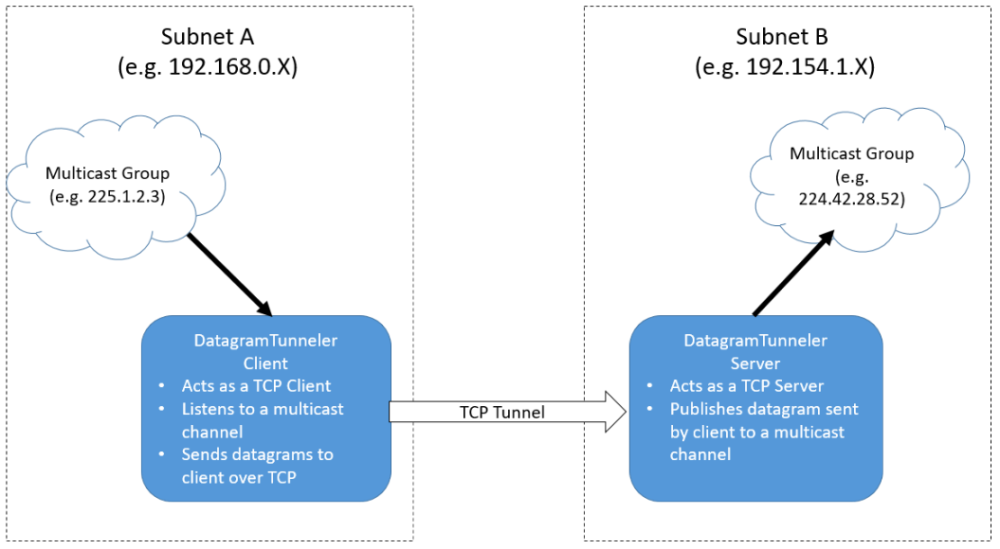
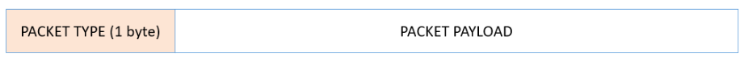
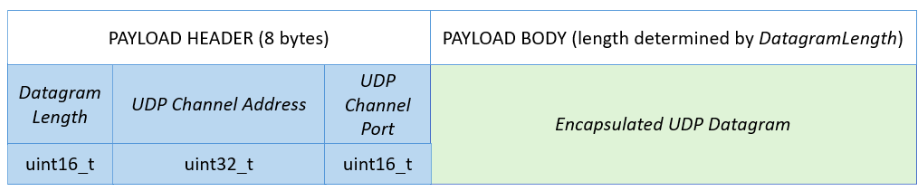

# DatagramTunneler

[](https://www.gnu.org/licenses/gpl-3.0.en.html)


DatagramTunneler forwards UDP multicast datagrams through a TCP connection. A client joins a multicast group, forwards received datagrams to a server, and the server republishes them on its own subnet.

It supports current Linux, macOS, and Windows 10/11 releases, direct command-line use, and reusable named tunnel definitions.

## Install

### Debian and Ubuntu

Install a Debian package from a release, or one you built locally, with `apt`:

```sh
sudo apt install ./dgramtunneler_<version>-1_<architecture>.deb
```

On Linux, the release build produces this `.deb` package alongside portable `.tar.gz` and `.zip` archives.

### macOS and Linux: Homebrew

A Homebrew formula template and release workflow are included, but the public `MarkoPaul0/dgramtunneler` tap has not yet been published. Homebrew installation will be documented here once the tap is live; until then, build from source below.

### Windows 10 and 11

[Windows CI runs](https://github.com/MarkoPaul0/DatagramTunneler/actions) produce portable ZIP artifacts. Extract one, add its `bin` directory to `PATH`, and run:

```powershell
dgramtunneler.exe --version
```

Winget, Chocolatey, and Scoop packages are not published yet.

### Build from source

Requirements: a C++20-capable compiler and CMake 3.16 or newer.

```sh
cmake -S . -B build-cmake
cmake --build build-cmake
cmake --install build-cmake --prefix ~/.local
```

The legacy Makefile remains available with `make`, but CMake is the supported build and installation path.

## First tunnel

Create and edit the configuration at the platform-default path:

```sh
dgramtunneler config init
dgramtunneler config edit
dgramtunneler tunnel list
```

Run an entry by alias:

```sh
dgramtunneler tunnel run office-client
```

Use `dgramtunneler tunnel show <alias>` to inspect the definition and `dgramtunneler tunnel validate [alias]` to check it before running.

## Named tunnels

Named definitions are stored in a versioned TOML configuration file. The default path is:

| Platform | Configuration path |
| --- | --- |
| macOS | `~/Library/Application Support/DatagramTunneler/config.toml` |
| Linux | `$XDG_CONFIG_HOME/dgramtunneler/config.toml`, or `~/.config/dgramtunneler/config.toml` |
| Windows | `%APPDATA%\DatagramTunneler\config.toml` |

Use `--config <path>` with any configuration or tunnel command to select another file.

```toml
version = 1

[tunnels.office-client]
mode = "client"
udp_interface = "192.168.1.20"
udp_group = "239.1.2.3:5000"
tcp_server = "192.168.1.10:14052"

[tunnels.office-server]
mode = "server"
udp_interface = "192.168.1.10"
tcp_listen_port = 14052
udp_destination = "239.1.2.4:5000"
```

`config edit` creates the starter file if needed, then opens it using `$VISUAL`, `$EDITOR`, or TextEdit, `vi`, or Notepad. The parser rejects unknown fields, duplicate aliases, invalid IPv4 addresses, and invalid ports. `tunnel run` runs in the foreground.

## Direct command-line use

Start the server before the client.

```sh
dgramtunneler --server -i <udp_iface_ip> -t <tcp_listen_port> [-u <udp_dst_ip>:<port>]
dgramtunneler --client -i <udp_iface_ip> -t <tcp_srv_ip>:<tcp_srv_port> -u <udp_dst_ip>:<port>
```

The server's `-u` destination is optional: when absent, it republishes each datagram to the multicast group encoded by the client.

## Create release packages

The root `VERSION` file is the release version. To create installable artifacts for the current platform:

```sh
cmake -S . -B build-cmake -DCMAKE_BUILD_TYPE=Release
cmake --build build-cmake
cpack --config build-cmake/CPackConfig.cmake -B release-artifacts
```

This produces `.tar.gz` and `.zip` archives named `dgramtunneler-<version>-<system>-<architecture>`. Linux also produces a Debian `.deb` package.

For Homebrew publishing, use the [tap release procedure](packaging/homebrew/README.md).

## Tests

The test suite covers protocol framing, command and configuration parsing, named-tunnel commands, and a loopback multicast round-trip test when Python 3 is available.

```sh
cmake -S . -B build-cmake -DBUILD_TESTING=ON
cmake --build build-cmake
ctest --test-dir build-cmake --output-on-failure
```

## How it works

DatagramTunneler transfers multicast traffic from a subnet where a multicast group is available to one where it is not. It has a client and a server:



### Client

Run the client where the multicast group is joinable. It connects to the server over TCP, joins the UDP multicast group, and forwards each received datagram using [DTEP](#dtep).

### Server

Run the server on the destination subnet. It accepts one client connection, then republishes each forwarded datagram to the configured UDP destination—or, when none is configured, to the group encoded in the DTEP packet. When either endpoint disconnects, both sides exit.

## DTEP

DTEP (Datagram Tunneler Encapsulation Protocol) is the binary framing used over the TCP connection:


A DTEP packet starts with a one-byte type field.

### `0x00` — Heartbeat

The client sends heartbeats to confirm that the connection remains alive.

### `0x01` — Datagram

This packet encapsulates a UDP datagram observed by the client:


* **Datagram length:** payload length, excluding the DTEP header.
* **UDP channel address and port:** the multicast group where the client received the datagram.
* **Encapsulated UDP datagram:** the original UDP payload.

## Licensing

See [LICENSE](LICENSE).
