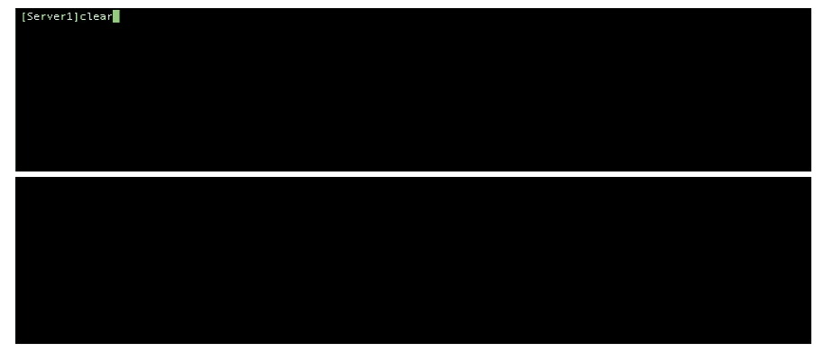

# DatagramTunneler

[](https://www.gnu.org/licenses/gpl-3.0.en.html)


<!--

-->



Simple cross-platform client/server program forwarding UDP datagrams through a TCP connection (aka tunnel). The client joins a multicast group and forwards the received datagrams to the server, which in turns multicasts them on its own subnet.

* Designed with simplicity in mind
* Supported on current Linux, macOS, and Windows 10/11 releases

## Content
[Requirements](#requirements)<br/>
[Installation](#installation)<br/>
[Named tunnels](#named-tunnels)<br/>
[Synopsis](#synopsis)<br/>
[Examples](#examples)<br/>
[How does it work?](#how_it_works)<br/>
[The DTEP Protocol](#dtep)<br/>
[Licensing](#licensing)<br/>

<a name="requirements"/>

## Requirements
* A computer running Linux, macOS, or Windows 10/11
* A C++20-capable compiler
* CMake 3.16 or later for the supported build and release workflow

<a name="installation"/>

## Installation in 10 seconds
* Download or clone the repository.
* Go into the repository: 
```
cd <path_to_the_repo>/DatagramTunneler
```
* Build with CMake (requires CMake 3.16 or later):
```
cmake -S . -B build-cmake
cmake --build build-cmake
```
* To display its invocation syntax, run:
```
./build-cmake/dgramtunneler
```
* To print the build version, run:
```
./build-cmake/dgramtunneler --version
```
* The existing Makefile build remains available during the migration:
```
make
```
* To display its invocation syntax, run:
```
./bin/datagramtunneler
```
For more info about how to run it, checkout the *Synopsis below*

### Release archives

The root `VERSION` file is the single source of the release version. To create release archives for the current platform:

```
cmake -S . -B build-cmake -DCMAKE_BUILD_TYPE=Release
cmake --build build-cmake
cpack --config build-cmake/CPackConfig.cmake -B release-artifacts
```

This produces `.tar.gz` and `.zip` archives named `dgramtunneler-<version>-<system>-<architecture>`. Each archive contains a top-level directory with `bin/dgramtunneler`.

On Linux, CPack also produces a Debian package named `dgramtunneler_<version>-1_<architecture>.deb`. Install a downloaded package with:

```
sudo apt install ./dgramtunneler_<version>-1_<architecture>.deb
```

### Homebrew

The Homebrew formula is maintained in a separate tap and must be pinned to a tagged source archive and its SHA-256 checksum. This repository includes the [formula template](packaging/homebrew/Formula/dgramtunneler.rb.in) and renderer used for each release. See [packaging/homebrew/README.md](packaging/homebrew/README.md) for the one-time tap setup and release procedure.

### Windows 10 and 11

The CI workflow builds and tests Windows ZIP artifacts on `windows-2022` and the current `windows-latest` runner. Download the appropriate `dgramtunneler-windows-*` ZIP artifact from the CI run, then use PowerShell to extract and run it:

```powershell
$archive = Get-ChildItem $HOME\Downloads\dgramtunneler-*.zip | Select-Object -First 1
$destination = Join-Path $env:LOCALAPPDATA 'DatagramTunneler'
Expand-Archive -LiteralPath $archive.FullName -DestinationPath $destination -Force
$binary = Get-ChildItem $destination -Filter dgramtunneler.exe -Recurse | Select-Object -First 1
& $binary.FullName --version
```

To use it by name for the current PowerShell session:

```powershell
$env:Path += ";$($binary.DirectoryName)"
dgramtunneler.exe --version
```

### Tests

The CMake build includes unit tests for DTEP framing and command-line parsing, plus a loopback multicast tunnel round-trip test when Python 3 is available:

```
cmake -S . -B build-cmake -DBUILD_TESTING=ON
cmake --build build-cmake
ctest --test-dir build-cmake --output-on-failure
```

<a name="named-tunnels"/>

## Named tunnels

For repeatable tunnel setups, store a named client or server definition in a versioned TOML configuration file. Create a documented starter file at the platform-default path:

```
dgramtunneler config init
dgramtunneler config path
dgramtunneler config edit
```

The default file is `~/Library/Application Support/DatagramTunneler/config.toml` on macOS, `$XDG_CONFIG_HOME/dgramtunneler/config.toml` (or `~/.config/dgramtunneler/config.toml`) on Linux, and `%APPDATA%\\DatagramTunneler\\config.toml` on Windows. Use `--config <path>` with any named-tunnel command to select another file.

```toml
version = 1

[tunnels.office-client]
mode = "client"
udp_interface = "192.168.1.20"
udp_group = "239.1.2.3:5000"
tcp_server = "192.168.1.10:14052"

[tunnels.office-server]
mode = "server"
udp_interface = "192.168.1.10"
tcp_listen_port = 14052
udp_destination = "239.1.2.4:5000"
```

Inspect and run a definition by alias:

```
dgramtunneler tunnel list
dgramtunneler tunnel show office-client
dgramtunneler tunnel validate office-client
dgramtunneler tunnel run office-client
```

`config edit` creates the starter file if needed, then opens it using `$VISUAL`, `$EDITOR`, or the platform editor (`TextEdit` on macOS, `vi` on Linux, and Notepad on Windows). `tunnel validate` without an alias validates the entire file. The parser deliberately accepts only this schema and rejects unknown fields, duplicate aliases, invalid IPv4 addresses, and invalid ports. `tunnel run` runs in the foreground; service installation and background status management remain separate concerns.

<a name="synopsis"/>

## Synopsis
In order to use the DatagramTunneler you need to start the server side first, then the client side. If you don't, the client will just fail to connect to the server and exit right away.
### Server
```
  dgramtunneler --server -i <udp_iface_ip> -t <tcp_listen_port> [-u <udp_dst_ip>:<port>]
```
* **<udp_iface_ip>**: interface used to publish the forwarded datagrams
* **<tcp_listen_port>**: tcp port used to listen for client connections
* **<udp_dst_ip>:\<port>**: (optional) udp destination IP and port where the server is publishing the forwarded datagrams. If not provided, datagrams are published on the same channel joined by the client.
  
### Client
```
  dgramtunneler --client -i <udp_iface_ip> -t <tcp_srv_ip>:<tcp_srv_port> -u <udp_dst_ip>:<port>
```
* **<udp_iface_ip>**: interface used to join the multicast channel provided by -u
* **<tcp_srv_ip>:\<port>**: IP and port of the server to which the datagram will be forwarded
* **<udp_dst_ip>**:**\<port>**: udp destination IP and port of the channel we want to join
  
<a name="examples"/>

## Examples 
(Don't forget to give a little star if this tool is useful to you :])
server side:
```
./bin/datagramtunneler --server -i 192.168.0.104 -u 228.14.28.52:1234 -t 28052
```

client side:
```
./bin/datagramtunneler --client -i 192.168.0.105 -u 228.1.2.3:7437 -t 192.168.0.104:28052
```


<a name="how_it_works"/>

## How does it work?
The purpose of the DatagramTunneler is to transfer multicast data from one subnet A to another subnet B where that multicast channel is not available. To achieve this, the DatagramTunneler is split into 2 sides: a client side and a server side, as shown on the diagram below:


### The Client Side
The client side should run in the subnet where the multicast channel is joinable. Once started it will do the following:
* connect to the DatagramListener Server (TCP)
* join the multicast channel (UDP)
* forward all the received datagrams to the server using the established TCP connection. Datagrams are transmitted throught TCP using the [Datagram Tunneler Encapsulation Protocol (or DTEP)](#dtep).

### The Server Side
The server side should run in the subnet where the multicast is not available. Once started it will do the following:
* listen for a client connection (note that only one connection is accepted throughout the lifetime of the Server/Client instances. Once the tunnel is disconnected, both ends exit.
* once a connection with a client is established, it will publish all the datagrams sent by the client to a multicast channel. That channel can be anything specified when launching the server, or if not specified, it will used the same multicast channel encoded with the datagram it received (c.f. [DTEP](#dtep)).


<a name="dtep"/>

### The Datagram Tunneler Encapsulation Protocol (DTEP)
The Datagram Tunneler Protocol or DTEP is a simple binary protocol, which is described by the following diagram:


A DTEP packet has a 1 byte header specifying the type of payload it contains.
#### Packet Type 0x00 = HEARTBEAT
This type of packet has no payload. It is sent by the client to the server and helps ensure both ends of the connection know if the other end is alive.
#### Packet Type 0x01 = DATAGRAM
This packet encapsulates the datagram observed by the client. Here is its complete description:


Although this diagram should be self explanatory, here is a break down of all the fields:
* **Datagram Length**: number of bytes of the encapsulated datagram (the DTEP header length is NOT included)
* **UDP Channel Address**: destination address of the multicast group which the client joined to receive that datagram
* **UDP Channel Port**: destination port of the multicast group which the client joined to receive that datagram
* **Encapsulated UDP Datagram**: actual datagram received by the client from the multicast channel

<a name="licensing"/>

## Licensing
[C.f. LICENSE](LICENSE)
